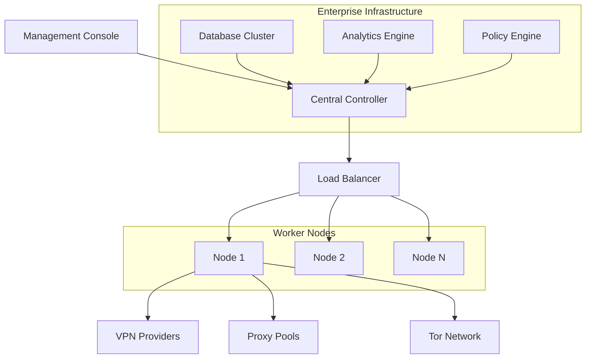

# Enterprise Features and Licensing

This comprehensive guide covers enterprise features, licensing options, deployment strategies, and advanced management capabilities for CyberRotate Pro in enterprise environments.

## 📋 Table of Contents

1. [Enterprise Overview](#enterprise-overview)
2. [Licensing Options](#licensing-options)
3. [Enterprise Features](#enterprise-features)
4. [Deployment Strategies](#deployment-strategies)
5. [Centralized Management](#centralized-management)
6. [Multi-tenant Architecture](#multi-tenant-architecture)
7. [Enterprise Security](#enterprise-security)
8. [Compliance and Auditing](#compliance-and-auditing)
9. [High Availability Setup](#high-availability-setup)
10. [Support and Maintenance](#support-and-maintenance)

---

## 🏢 Enterprise Overview

CyberRotate Pro Enterprise Edition is designed for large-scale deployments with advanced management, security, and compliance features.

### Enterprise Benefits

```yaml
enterprise_advantages:
  scalability:
    - "Support for 1000+ concurrent users"
    - "Distributed deployment architecture"
    - "Load balancing and failover"
    - "Auto-scaling capabilities"
  
  management:
    - "Centralized administration console"
    - "Role-based access control (RBAC)"
    - "Bulk configuration management"
    - "Automated deployment and updates"
  
  security:
    - "Enterprise-grade encryption"
    - "Advanced threat protection"
    - "Zero-trust network access"
    - "Security policy enforcement"
  
  compliance:
    - "Audit trails and logging"
    - "Compliance reporting"
    - "Data sovereignty controls"
    - "Regulatory framework support"
  
  support:
    - "24/7 priority support"
    - "Dedicated account manager"
    - "Professional services"
    - "Custom integration support"
```

### Architecture Overview



---

## 📜 Licensing Options

### License Types

#### Enterprise Core License
```json
{
  "license_type": "enterprise_core",
  "features": [
    "Unlimited concurrent users",
    "Centralized management",
    "Basic RBAC",
    "Standard support",
    "Basic analytics",
    "Single data center deployment"
  ],
  "pricing": {
    "model": "annual_subscription",
    "base_price": "$10,000/year",
    "user_tier": "Up to 500 users"
  },
  "support": {
    "level": "business",
    "hours": "9x5",
    "response_time": "4 hours"
  }
}
```

#### Enterprise Premium License
```json
{
  "license_type": "enterprise_premium",
  "features": [
    "All Core features",
    "Advanced RBAC",
    "Multi-data center deployment",
    "High availability setup",
    "Advanced analytics",
    "Custom integrations",
    "Compliance reporting"
  ],
  "pricing": {
    "model": "annual_subscription", 
    "base_price": "$25,000/year",
    "user_tier": "Up to 2000 users"
  },
  "support": {
    "level": "premium",
    "hours": "24x7",
    "response_time": "1 hour"
  }
}
```

#### Enterprise Unlimited License
```json
{
  "license_type": "enterprise_unlimited",
  "features": [
    "All Premium features",
    "Unlimited users",
    "Global deployment",
    "Custom development",
    "White-label options",
    "Advanced security features",
    "Dedicated infrastructure"
  ],
  "pricing": {
    "model": "custom_quote",
    "base_price": "Contact Sales",
    "user_tier": "Unlimited"
  },
  "support": {
    "level": "enterprise",
    "hours": "24x7",
    "response_time": "30 minutes",
    "dedicated_support": true
  }
}
```

### License Management

```python
class LicenseManager:
    def __init__(self, license_server_url):
        self.license_server = license_server_url
        self.local_cache = {}
        self.validation_interval = 3600  # 1 hour
    
    async def validate_license(self, license_key):
        """Validate license with license server"""
        try:
            response = await self.check_license_server(license_key)
            
            license_info = {
                "valid": response["valid"],
                "type": response["license_type"],
                "features": response["enabled_features"],
                "expiry": response["expiry_date"],
                "max_users": response["max_users"],
                "organization": response["organization"]
            }
            
            # Cache valid license
            if license_info["valid"]:
                self.local_cache[license_key] = license_info
            
            return license_info
            
        except Exception as e:
            # Fallback to cached license if server unavailable
            if license_key in self.local_cache:
                return self.local_cache[license_key]
            
            raise LicenseValidationError(f"License validation failed: {e}")
    
    def check_feature_access(self, feature_name, license_info):
        """Check if feature is available in current license"""
        if not license_info["valid"]:
            return False
        
        return feature_name in license_info["features"]
    
    def get_usage_limits(self, license_info):
        """Get usage limits based on license"""
        return {
            "max_concurrent_users": license_info.get("max_users", 0),
            "max_api_calls_per_hour": license_info.get("api_limit", 1000),
            "max_data_transfer_gb": license_info.get("data_limit", 100),
            "max_retention_days": license_info.get("retention_limit", 30)
        }
```

### License Activation

```yaml
license_activation:
  methods:
    online:
      description: "Automatic activation via internet"
      requirements: ["Internet connection", "License key"]
      process:
        - "Enter license key in management console"
        - "System contacts license server"
        - "License validated and activated"
        - "Features unlocked automatically"
    
    offline:
      description: "Manual activation for air-gapped environments"
      requirements: ["License file", "System fingerprint"]
      process:
        - "Generate system fingerprint"
        - "Submit fingerprint to ZehraSec"
        - "Receive signed license file"
        - "Import license file to system"
    
    proxy:
      description: "Activation through corporate proxy"
      requirements: ["Proxy configuration", "License key"]
      process:
        - "Configure proxy settings"
        - "Standard online activation"
        - "Proxy handles external communication"

  license_file_format:
    format: "JSON with digital signature"
    encryption: "RSA-4096"
    validity_check: "SHA-256 hash verification"
    example: |
      {
        "license_key": "ENT-XXXX-XXXX-XXXX",
        "organization": "ACME Corporation",
        "license_type": "enterprise_premium",
        "issued_date": "2025-01-01",
        "expiry_date": "2025-12-31",
        "max_users": 2000,
        "enabled_features": [...],
        "signature": "base64_encoded_signature"
      }
```

---

## 🚀 Enterprise Features

### Advanced Analytics and Reporting

```python
class EnterpriseAnalytics:
    def __init__(self):
        self.data_warehouse = DataWarehouse()
        self.report_engine = ReportEngine()
        self.ml_analytics = MLAnalytics()
    
    async def generate_executive_dashboard(self, org_id):
        """Generate executive-level dashboard"""
        return {
            "usage_metrics": {
                "total_users": await self.get_total_users(org_id),
                "active_users_today": await self.get_active_users(org_id, "today"),
                "data_transferred_tb": await self.get_data_transferred(org_id, "month"),
                "cost_savings": await self.calculate_cost_savings(org_id)
            },
            "performance_metrics": {
                "avg_connection_time": await self.get_avg_connection_time(org_id),
                "success_rate": await self.get_success_rate(org_id),
                "uptime_percentage": await self.get_uptime(org_id)
            },
            "security_metrics": {
                "blocked_threats": await self.get_blocked_threats(org_id),
                "compliance_score": await self.get_compliance_score(org_id),
                "security_incidents": await self.get_security_incidents(org_id)
            },
            "trends": {
                "usage_trend": await self.get_usage_trend(org_id, "3months"),
                "performance_trend": await self.get_performance_trend(org_id, "3months"),
                "cost_trend": await self.get_cost_trend(org_id, "3months")
            }
        }
    
    async def generate_compliance_report(self, org_id, compliance_framework):
        """Generate compliance report for specific framework"""
        frameworks = {
            "SOC2": self.generate_soc2_report,
            "ISO27001": self.generate_iso27001_report,
            "GDPR": self.generate_gdpr_report,
            "HIPAA": self.generate_hipaa_report
        }
        
        if compliance_framework in frameworks:
            return await frameworks[compliance_framework](org_id)
        else:
            raise ValueError(f"Unsupported compliance framework: {compliance_framework}")
```

### Role-Based Access Control (RBAC)

```json
{
  "rbac_config": {
    "roles": {
      "super_admin": {
        "description": "Full system access",
        "permissions": ["*"],
        "inherits": []
      },
      "org_admin": {
        "description": "Organization administrator",
        "permissions": [
          "users:create", "users:update", "users:delete", "users:read",
          "policies:create", "policies:update", "policies:delete", "policies:read",
          "analytics:read", "reports:generate",
          "settings:update"
        ],
        "inherits": []
      },
      "security_admin": {
        "description": "Security policy management",
        "permissions": [
          "policies:create", "policies:update", "policies:delete", "policies:read",
          "security:configure", "security:monitor",
          "audit:read", "incidents:manage"
        ],
        "inherits": []
      },
      "operator": {
        "description": "Day-to-day operations",
        "permissions": [
          "connections:manage", "monitoring:read",
          "basic_settings:update", "reports:read"
        ],
        "inherits": []
      },
      "end_user": {
        "description": "Standard user access",
        "permissions": [
          "connection:use", "profile:update",
          "usage:read"
        ],
        "inherits": []
      }
    },
    "permission_groups": {
      "user_management": [
        "users:create", "users:read", "users:update", "users:delete"
      ],
      "policy_management": [
        "policies:create", "policies:read", "policies:update", "policies:delete"
      ],
      "security_management": [
        "security:configure", "security:monitor", "audit:read"
      ]
    }
  }
}
```

### Bulk User Management

```python
class BulkUserManager:
    def __init__(self, ldap_config=None, ad_config=None):
        self.ldap = LDAPConnector(ldap_config) if ldap_config else None
        self.ad = ActiveDirectoryConnector(ad_config) if ad_config else None
    
    async def import_users_from_csv(self, csv_file_path, default_role="end_user"):
        """Import users from CSV file"""
        results = []
        
        with open(csv_file_path, 'r') as file:
            reader = csv.DictReader(file)
            
            for row in reader:
                try:
                    user_data = {
                        "username": row["username"],
                        "email": row["email"],
                        "full_name": row.get("full_name", ""),
                        "department": row.get("department", ""),
                        "role": row.get("role", default_role),
                        "groups": row.get("groups", "").split(",") if row.get("groups") else []
                    }
                    
                    user = await self.create_user(user_data)
                    results.append({"status": "success", "user": user})
                    
                except Exception as e:
                    results.append({
                        "status": "error", 
                        "username": row.get("username", "unknown"),
                        "error": str(e)
                    })
        
        return results
    
    async def sync_with_ldap(self):
        """Synchronize users with LDAP directory"""
        if not self.ldap:
            raise ValueError("LDAP not configured")
        
        ldap_users = await self.ldap.get_all_users()
        local_users = await self.get_all_local_users()
        
        sync_results = {
            "created": [],
            "updated": [],
            "disabled": [],
            "errors": []
        }
        
        # Create/update users from LDAP
        for ldap_user in ldap_users:
            try:
                local_user = await self.find_user_by_username(ldap_user["username"])
                
                if local_user:
                    # Update existing user
                    updated_user = await self.update_user_from_ldap(local_user, ldap_user)
                    sync_results["updated"].append(updated_user)
                else:
                    # Create new user
                    new_user = await self.create_user_from_ldap(ldap_user)
                    sync_results["created"].append(new_user)
                    
            except Exception as e:
                sync_results["errors"].append({
                    "username": ldap_user.get("username", "unknown"),
                    "error": str(e)
                })
        
        # Disable users not in LDAP
        ldap_usernames = {user["username"] for user in ldap_users}
        for local_user in local_users:
            if local_user["username"] not in ldap_usernames:
                await self.disable_user(local_user["id"])
                sync_results["disabled"].append(local_user)
        
        return sync_results
```

### Enterprise Policies

```yaml
enterprise_policies:
  network_policies:
    allowed_protocols:
      - "OpenVPN UDP"
      - "OpenVPN TCP"
      - "IKEv2"
    
    blocked_protocols:
      - "PPTP"
      - "L2TP"
    
    geographic_restrictions:
      allowed_countries: ["US", "CA", "UK", "DE", "FR"]
      blocked_countries: ["CN", "RU", "IR", "KP"]
    
    connection_limits:
      max_concurrent_per_user: 3
      max_session_duration: "8 hours"
      idle_timeout: "30 minutes"
  
  security_policies:
    encryption_requirements:
      minimum_cipher: "AES-256"
      require_perfect_forward_secrecy: true
      allowed_key_exchanges: ["ECDH", "DH"]
    
    authentication:
      require_2fa: true
      password_policy:
        min_length: 12
        require_uppercase: true
        require_lowercase: true
        require_numbers: true
        require_symbols: true
        history_length: 12
    
    monitoring:
      log_all_connections: true
      monitor_data_usage: true
      alert_on_suspicious_activity: true
  
  compliance_policies:
    data_retention:
      connection_logs: "1 year"
      audit_logs: "7 years"
      user_data: "as_required"
    
    data_sovereignty:
      enforce_data_residency: true
      allowed_data_locations: ["US", "EU"]
      encryption_in_transit: true
      encryption_at_rest: true
```

---

## 🏗️ Deployment Strategies

### Container Orchestration

#### Kubernetes Deployment

```yaml
# cyberrotate-enterprise.yaml
apiVersion: apps/v1
kind: Deployment
metadata:
  name: cyberrotate-enterprise
  namespace: cyberrotate
spec:
  replicas: 3
  selector:
    matchLabels:
      app: cyberrotate-enterprise
  template:
    metadata:
      labels:
        app: cyberrotate-enterprise
    spec:
      containers:
      - name: cyberrotate
        image: zehrasec/cyberrotate-enterprise:latest
        ports:
        - containerPort: 8080
        - containerPort: 8443
        env:
        - name: LICENSE_KEY
          valueFrom:
            secretKeyRef:
              name: cyberrotate-license
              key: license-key
        - name: DB_CONNECTION_STRING
          valueFrom:
            secretKeyRef:
              name: cyberrotate-db
              key: connection-string
        resources:
          requests:
            memory: "1Gi"
            cpu: "500m"
          limits:
            memory: "4Gi"
            cpu: "2"
        volumeMounts:
        - name: config-volume
          mountPath: /app/config
        - name: data-volume
          mountPath: /app/data
      volumes:
      - name: config-volume
        configMap:
          name: cyberrotate-config
      - name: data-volume
        persistentVolumeClaim:
          claimName: cyberrotate-data

---
apiVersion: v1
kind: Service
metadata:
  name: cyberrotate-service
  namespace: cyberrotate
spec:
  selector:
    app: cyberrotate-enterprise
  ports:
  - name: http
    port: 80
    targetPort: 8080
  - name: https
    port: 443
    targetPort: 8443
  type: LoadBalancer

---
apiVersion: networking.k8s.io/v1
kind: Ingress
metadata:
  name: cyberrotate-ingress
  namespace: cyberrotate
  annotations:
    nginx.ingress.kubernetes.io/ssl-redirect: "true"
    cert-manager.io/cluster-issuer: "letsencrypt-prod"
spec:
  tls:
  - hosts:
    - cyberrotate.company.com
    secretName: cyberrotate-tls
  rules:
  - host: cyberrotate.company.com
    http:
      paths:
      - path: /
        pathType: Prefix
        backend:
          service:
            name: cyberrotate-service
            port:
              number: 80
```

#### Docker Compose for Development

```yaml
# docker-compose.enterprise.yml
version: '3.8'

services:
  cyberrotate-app:
    image: zehrasec/cyberrotate-enterprise:latest
    container_name: cyberrotate-app
    ports:
      - "8080:8080"
      - "8443:8443"
    environment:
      - LICENSE_KEY=${LICENSE_KEY}
      - DB_HOST=postgres
      - DB_NAME=cyberrotate
      - DB_USER=cyberrotate
      - DB_PASSWORD=${DB_PASSWORD}
      - REDIS_URL=redis://redis:6379
    volumes:
      - ./config:/app/config
      - cyberrotate_data:/app/data
    depends_on:
      - postgres
      - redis
    restart: unless-stopped

  postgres:
    image: postgres:15
    container_name: cyberrotate-db
    environment:
      - POSTGRES_DB=cyberrotate
      - POSTGRES_USER=cyberrotate
      - POSTGRES_PASSWORD=${DB_PASSWORD}
    volumes:
      - postgres_data:/var/lib/postgresql/data
    restart: unless-stopped

  redis:
    image: redis:7-alpine
    container_name: cyberrotate-cache
    volumes:
      - redis_data:/data
    restart: unless-stopped

  nginx:
    image: nginx:alpine
    container_name: cyberrotate-proxy
    ports:
      - "80:80"
      - "443:443"
    volumes:
      - ./nginx.conf:/etc/nginx/nginx.conf
      - ./ssl:/etc/nginx/ssl
    depends_on:
      - cyberrotate-app
    restart: unless-stopped

volumes:
  cyberrotate_data:
  postgres_data:
  redis_data:
```

### Cloud Deployment

#### AWS Deployment

```yaml
# AWS CloudFormation Template
AWSTemplateFormatVersion: '2010-09-09'
Description: 'CyberRotate Enterprise on AWS'

Parameters:
  InstanceType:
    Type: String
    Default: c5.xlarge
    AllowedValues: [c5.large, c5.xlarge, c5.2xlarge, c5.4xlarge]
  
  LicenseKey:
    Type: String
    NoEcho: true
    Description: CyberRotate Enterprise License Key

Resources:
  # VPC and Networking
  VPC:
    Type: AWS::EC2::VPC
    Properties:
      CidrBlock: 10.0.0.0/16
      EnableDnsHostnames: true
      EnableDnsSupport: true

  # Application Load Balancer
  ALB:
    Type: AWS::ElasticLoadBalancingV2::LoadBalancer
    Properties:
      Type: application
      Scheme: internet-facing
      Subnets: [!Ref PublicSubnet1, !Ref PublicSubnet2]
      SecurityGroups: [!Ref ALBSecurityGroup]

  # ECS Cluster
  ECSCluster:
    Type: AWS::ECS::Cluster
    Properties:
      ClusterName: cyberrotate-enterprise

  # ECS Service
  ECSService:
    Type: AWS::ECS::Service
    Properties:
      Cluster: !Ref ECSCluster
      TaskDefinition: !Ref TaskDefinition
      DesiredCount: 3
      LaunchType: FARGATE
      NetworkConfiguration:
        AwsvpcConfiguration:
          SecurityGroups: [!Ref ECSSecurityGroup]
          Subnets: [!Ref PrivateSubnet1, !Ref PrivateSubnet2]

  # RDS Database
  Database:
    Type: AWS::RDS::DBInstance
    Properties:
      DBInstanceClass: db.r5.large
      Engine: postgres
      MasterUsername: cyberrotate
      MasterUserPassword: !Ref DatabasePassword
      AllocatedStorage: 100
      DBSubnetGroupName: !Ref DBSubnetGroup
      VPCSecurityGroups: [!Ref DatabaseSecurityGroup]
```

#### Azure Deployment

```yaml
# Azure Resource Manager Template
{
  "$schema": "https://schema.management.azure.com/schemas/2019-04-01/deploymentTemplate.json#",
  "contentVersion": "1.0.0.0",
  "parameters": {
    "licenseKey": {
      "type": "securestring",
      "metadata": {
        "description": "CyberRotate Enterprise License Key"
      }
    }
  },
  "resources": [
    {
      "type": "Microsoft.ContainerInstance/containerGroups",
      "apiVersion": "2021-03-01",
      "name": "cyberrotate-enterprise",
      "location": "[resourceGroup().location]",
      "properties": {
        "containers": [
          {
            "name": "cyberrotate-app",
            "properties": {
              "image": "zehrasec/cyberrotate-enterprise:latest",
              "ports": [
                {
                  "port": 8080,
                  "protocol": "TCP"
                }
              ],
              "environmentVariables": [
                {
                  "name": "LICENSE_KEY",
                  "secureValue": "[parameters('licenseKey')]"
                }
              ],
              "resources": {
                "requests": {
                  "cpu": 2,
                  "memoryInGB": 4
                }
              }
            }
          }
        ],
        "osType": "Linux",
        "ipAddress": {
          "type": "Public",
          "ports": [
            {
              "port": 8080,
              "protocol": "TCP"
            }
          ]
        }
      }
    }
  ]
}
```

---

## 🎛️ Centralized Management

### Management Console

```python
class EnterpriseManagementConsole:
    def __init__(self):
        self.node_manager = NodeManager()
        self.user_manager = UserManager()
        self.policy_manager = PolicyManager()
        self.monitoring = MonitoringService()
    
    async def get_system_overview(self):
        """Get enterprise system overview"""
        return {
            "cluster_status": await self.node_manager.get_cluster_status(),
            "user_statistics": await self.user_manager.get_user_statistics(),
            "active_policies": await self.policy_manager.get_active_policies(),
            "performance_metrics": await self.monitoring.get_system_metrics(),
            "alerts": await self.monitoring.get_active_alerts(),
            "license_status": await self.get_license_status()
        }
    
    async def manage_nodes(self, action, node_ids):
        """Manage cluster nodes"""
        actions = {
            "restart": self.node_manager.restart_nodes,
            "update": self.node_manager.update_nodes,
            "scale_up": self.node_manager.scale_up,
            "scale_down": self.node_manager.scale_down,
            "drain": self.node_manager.drain_nodes
        }
        
        if action in actions:
            return await actions[action](node_ids)
        else:
            raise ValueError(f"Unknown action: {action}")
    
    async def bulk_policy_update(self, policy_updates):
        """Apply policy updates across the enterprise"""
        results = []
        
        for policy_update in policy_updates:
            try:
                result = await self.policy_manager.update_policy(
                    policy_update["policy_id"],
                    policy_update["changes"],
                    policy_update.get("target_groups", ["all"])
                )
                results.append({"status": "success", "policy_id": policy_update["policy_id"]})
            except Exception as e:
                results.append({
                    "status": "error",
                    "policy_id": policy_update["policy_id"],
                    "error": str(e)
                })
        
        return results
```

### Configuration Management

```yaml
centralized_config:
  distribution_method: "push"  # push, pull, hybrid
  
  config_hierarchy:
    global:
      level: 1
      scope: "all_nodes"
      override: false
      
    datacenter:
      level: 2
      scope: "datacenter_nodes"
      override: true
      
    cluster:
      level: 3
      scope: "cluster_nodes"
      override: true
      
    node:
      level: 4
      scope: "single_node"
      override: true

  config_sections:
    network:
      global_defaults: true
      local_override: false
      validation: "strict"
      
    security:
      global_defaults: true
      local_override: false
      validation: "strict"
      
    performance:
      global_defaults: false
      local_override: true
      validation: "loose"
      
    logging:
      global_defaults: true
      local_override: true
      validation: "medium"

  validation_rules:
    strict:
      - "schema_validation"
      - "cross_reference_check"
      - "security_compliance"
      - "performance_impact"
    
    medium:
      - "schema_validation"
      - "basic_compliance"
    
    loose:
      - "schema_validation"
```

---

## 🏢 Multi-tenant Architecture

### Tenant Isolation

```python
class MultiTenantManager:
    def __init__(self):
        self.tenant_db = TenantDatabase()
        self.resource_allocator = ResourceAllocator()
        self.billing_manager = BillingManager()
    
    async def create_tenant(self, tenant_config):
        """Create new tenant"""
        tenant_id = await self.generate_tenant_id()
        
        # Create tenant database schema
        await self.tenant_db.create_tenant_schema(tenant_id)
        
        # Allocate resources
        resources = await self.resource_allocator.allocate_tenant_resources(
            tenant_id, 
            tenant_config["resource_requirements"]
        )
        
        # Setup billing
        await self.billing_manager.setup_tenant_billing(
            tenant_id,
            tenant_config["billing_plan"]
        )
        
        # Create default admin user
        admin_user = await self.create_tenant_admin(
            tenant_id,
            tenant_config["admin_user"]
        )
        
        return {
            "tenant_id": tenant_id,
            "resources": resources,
            "admin_user": admin_user,
            "status": "active"
        }
    
    async def get_tenant_usage(self, tenant_id):
        """Get tenant resource usage"""
        return {
            "users": await self.get_tenant_user_count(tenant_id),
            "connections": await self.get_tenant_connection_stats(tenant_id),
            "data_transfer": await self.get_tenant_data_usage(tenant_id),
            "api_calls": await self.get_tenant_api_usage(tenant_id),
            "storage": await self.get_tenant_storage_usage(tenant_id)
        }
    
    async def enforce_tenant_limits(self, tenant_id):
        """Enforce tenant resource limits"""
        tenant_plan = await self.get_tenant_plan(tenant_id)
        current_usage = await self.get_tenant_usage(tenant_id)
        
        violations = []
        
        # Check user limit
        if current_usage["users"] > tenant_plan["max_users"]:
            violations.append("user_limit_exceeded")
            await self.block_new_user_creation(tenant_id)
        
        # Check data transfer limit
        if current_usage["data_transfer"] > tenant_plan["max_data_gb"]:
            violations.append("data_limit_exceeded")
            await self.throttle_tenant_connections(tenant_id)
        
        # Check API limit
        if current_usage["api_calls"] > tenant_plan["max_api_calls"]:
            violations.append("api_limit_exceeded")
            await self.rate_limit_tenant_api(tenant_id)
        
        return violations
```

### Tenant Configuration

```json
{
  "tenant_plans": {
    "starter": {
      "max_users": 50,
      "max_concurrent_connections": 100,
      "max_data_gb_per_month": 100,
      "max_api_calls_per_hour": 1000,
      "features": [
        "basic_vpn", "basic_proxy", "standard_support"
      ],
      "price_per_month": 99
    },
    "professional": {
      "max_users": 500,
      "max_concurrent_connections": 1000,
      "max_data_gb_per_month": 1000,
      "max_api_calls_per_hour": 10000,
      "features": [
        "advanced_vpn", "premium_proxy", "tor_integration",
        "analytics", "priority_support"
      ],
      "price_per_month": 499
    },
    "enterprise": {
      "max_users": "unlimited",
      "max_concurrent_connections": "unlimited",
      "max_data_gb_per_month": "unlimited",
      "max_api_calls_per_hour": "unlimited",
      "features": [
        "all_features", "custom_integrations",
        "dedicated_support", "sla_guarantee"
      ],
      "price_per_month": "custom"
    }
  }
}
```

---

## 🔒 Enterprise Security

### Advanced Security Features

```python
class EnterpriseSecurityManager:
    def __init__(self):
        self.threat_detector = ThreatDetector()
        self.security_policies = SecurityPolicyEngine()
        self.audit_logger = AuditLogger()
        self.incident_manager = IncidentManager()
    
    async def monitor_security_threats(self):
        """Continuous security threat monitoring"""
        while True:
            try:
                # Monitor for suspicious activities
                suspicious_activities = await self.threat_detector.scan_activities()
                
                for activity in suspicious_activities:
                    # Classify threat level
                    threat_level = await self.classify_threat(activity)
                    
                    # Take appropriate action
                    if threat_level == "critical":
                        await self.handle_critical_threat(activity)
                    elif threat_level == "high":
                        await self.handle_high_threat(activity)
                    elif threat_level == "medium":
                        await self.handle_medium_threat(activity)
                    
                    # Log incident
                    await self.audit_logger.log_security_incident(activity, threat_level)
                
                await asyncio.sleep(60)  # Check every minute
                
            except Exception as e:
                await self.audit_logger.log_error(f"Security monitoring error: {e}")
                await asyncio.sleep(300)  # Wait 5 minutes on error
    
    async def handle_critical_threat(self, threat):
        """Handle critical security threats"""
        # Immediately block source
        await self.block_ip_address(threat["source_ip"])
        
        # Isolate affected users/sessions
        await self.isolate_affected_sessions(threat["affected_sessions"])
        
        # Send immediate alerts
        await self.send_critical_alert(threat)
        
        # Create security incident
        incident = await self.incident_manager.create_incident(
            threat, severity="critical"
        )
        
        return incident
    
    async def implement_zero_trust(self, user_session):
        """Implement zero-trust security model"""
        # Verify user identity
        identity_verified = await self.verify_user_identity(user_session["user_id"])
        
        # Check device trust
        device_trusted = await self.verify_device_trust(user_session["device_id"])
        
        # Evaluate context
        context_score = await self.evaluate_context(user_session)
        
        # Determine access level
        if identity_verified and device_trusted and context_score > 0.8:
            return {"access": "full", "score": context_score}
        elif identity_verified and context_score > 0.6:
            return {"access": "limited", "score": context_score}
        else:
            return {"access": "denied", "score": context_score}
```

### Security Compliance

```yaml
compliance_frameworks:
  SOC2:
    type_1:
      controls:
        - "Access control management"
        - "Change management"
        - "Risk management"
        - "Vendor management"
      audit_frequency: "annual"
      
    type_2:
      controls:
        - "All Type 1 controls"
        - "Operating effectiveness over time"
      audit_frequency: "continuous"
      monitoring_period: "12 months"

  ISO27001:
    clauses:
      A5: "Information security policies"
      A6: "Organization of information security"
      A7: "Human resource security"
      A8: "Asset management"
      A9: "Access control"
      A10: "Cryptography"
      A11: "Physical and environmental security"
      A12: "Operations security"
      A13: "Communications security"
      A14: "System acquisition, development and maintenance"
      A15: "Supplier relationships"
      A16: "Information security incident management"
      A17: "Information security aspects of business continuity"
      A18: "Compliance"
    
    audit_cycle: "3 years"
    surveillance_audits: "annual"

  GDPR:
    principles:
      - "Lawfulness, fairness and transparency"
      - "Purpose limitation"
      - "Data minimisation"
      - "Accuracy"
      - "Storage limitation"
      - "Integrity and confidentiality"
      - "Accountability"
    
    rights:
      - "Right to information"
      - "Right of access"
      - "Right to rectification"
      - "Right to erasure"
      - "Right to restrict processing"
      - "Right to data portability"
      - "Right to object"
      - "Rights related to automated decision making"

  HIPAA:
    safeguards:
      administrative:
        - "Security officer assignment"
        - "Workforce training"
        - "Information access management"
        - "Security awareness training"
        
      physical:
        - "Facility access controls"
        - "Workstation use"
        - "Device and media controls"
        
      technical:
        - "Access control"
        - "Audit controls"
        - "Integrity"
        - "Person or entity authentication"
        - "Transmission security"
```

---

## 📊 Compliance and Auditing

### Audit Trail System

```python
class AuditSystem:
    def __init__(self):
        self.audit_db = AuditDatabase()
        self.compliance_engine = ComplianceEngine()
        self.report_generator = ReportGenerator()
    
    async def log_audit_event(self, event_type, user_id, resource, action, result, details=None):
        """Log audit event"""
        audit_record = {
            "timestamp": datetime.utcnow(),
            "event_type": event_type,
            "user_id": user_id,
            "resource": resource,
            "action": action,
            "result": result,
            "details": details or {},
            "source_ip": self.get_source_ip(),
            "user_agent": self.get_user_agent(),
            "session_id": self.get_session_id()
        }
        
        # Store in audit database
        await self.audit_db.insert_audit_record(audit_record)
        
        # Check for compliance violations
        await self.compliance_engine.check_compliance(audit_record)
        
        return audit_record
    
    async def generate_audit_report(self, start_date, end_date, filters=None):
        """Generate audit report for specified period"""
        audit_records = await self.audit_db.get_audit_records(
            start_date, end_date, filters
        )
        
        report = {
            "period": {"start": start_date, "end": end_date},
            "total_events": len(audit_records),
            "event_summary": self.summarize_events(audit_records),
            "user_activity": self.analyze_user_activity(audit_records),
            "resource_access": self.analyze_resource_access(audit_records),
            "compliance_status": await self.compliance_engine.assess_compliance(audit_records),
            "anomalies": self.detect_anomalies(audit_records)
        }
        
        return report
    
    async def export_audit_data(self, format_type, start_date, end_date, filters=None):
        """Export audit data in various formats"""
        records = await self.audit_db.get_audit_records(start_date, end_date, filters)
        
        if format_type == "csv":
            return self.export_to_csv(records)
        elif format_type == "json":
            return self.export_to_json(records)
        elif format_type == "xml":
            return self.export_to_xml(records)
        elif format_type == "siem":
            return self.export_to_siem_format(records)
        else:
            raise ValueError(f"Unsupported export format: {format_type}")
```

### Compliance Reporting

```yaml
compliance_reports:
  automated_reports:
    daily_security_summary:
      schedule: "0 6 * * *"  # 6 AM daily
      content:
        - "Failed login attempts"
        - "Policy violations"
        - "System alerts"
        - "Performance metrics"
      recipients: ["security@company.com"]
      
    weekly_compliance_check:
      schedule: "0 8 * * 1"  # 8 AM Mondays
      content:
        - "Compliance framework status"
        - "Audit findings"
        - "Remediation progress"
        - "Risk assessment"
      recipients: ["compliance@company.com", "management@company.com"]
      
    monthly_executive_report:
      schedule: "0 9 1 * *"  # 9 AM first day of month
      content:
        - "Executive summary"
        - "Key performance indicators"
        - "Compliance posture"
        - "Strategic recommendations"
      recipients: ["executives@company.com"]

  on_demand_reports:
    incident_report:
      trigger: "security_incident"
      content:
        - "Incident timeline"
        - "Impact assessment"
        - "Root cause analysis"
        - "Remediation actions"
      
    compliance_assessment:
      trigger: "manual_request"
      content:
        - "Current compliance status"
        - "Gap analysis"
        - "Remediation plan"
        - "Timeline for compliance"
```

---

## ⚡ High Availability Setup

### HA Architecture

```yaml
high_availability:
  active_active_deployment:
    load_balancer:
      type: "Layer 7"
      algorithm: "least_connections"
      health_checks:
        interval: "10s"
        timeout: "5s"
        healthy_threshold: 2
        unhealthy_threshold: 3
    
    application_nodes:
      min_nodes: 3
      max_nodes: 10
      auto_scaling:
        cpu_threshold: 70
        memory_threshold: 80
        scale_up_cooldown: "5m"
        scale_down_cooldown: "15m"
    
    database:
      type: "PostgreSQL Cluster"
      nodes: 3
      replication: "streaming"
      failover: "automatic"
      backup_schedule: "0 2 * * *"  # 2 AM daily
    
    cache:
      type: "Redis Cluster"
      nodes: 6
      replication_factor: 2
      sharding: "consistent_hash"
    
    monitoring:
      health_check_endpoints:
        - "/health"
        - "/ready" 
        - "/metrics"
      
      alerting:
        node_down: "immediate"
        high_latency: "5m"
        error_rate_high: "2m"

  disaster_recovery:
    backup_strategy:
      full_backup:
        frequency: "weekly"
        retention: "3 months"
        location: "offsite_storage"
      
      incremental_backup:
        frequency: "daily"
        retention: "30 days"
        location: "secondary_datacenter"
      
      transaction_log_backup:
        frequency: "15m"
        retention: "7 days"
        location: "both"
    
    recovery_procedures:
      rto_target: "15 minutes"  # Recovery Time Objective
      rpo_target: "5 minutes"   # Recovery Point Objective
      
      automated_failover:
        enabled: true
        triggers:
          - "primary_datacenter_down"
          - "database_cluster_failure"
          - "network_partition"
      
      manual_procedures:
        - "Full datacenter migration"
        - "Partial service recovery"
        - "Data restoration from backup"
```

### Monitoring and Alerting

```python
class HAMonitoring:
    def __init__(self):
        self.metrics_collector = MetricsCollector()
        self.alert_manager = AlertManager()
        self.health_checker = HealthChecker()
    
    async def monitor_cluster_health(self):
        """Monitor cluster health continuously"""
        while True:
            try:
                cluster_health = await self.assess_cluster_health()
                
                # Check for critical issues
                if cluster_health["status"] == "critical":
                    await self.handle_critical_cluster_issue(cluster_health)
                elif cluster_health["status"] == "warning":
                    await self.handle_cluster_warning(cluster_health)
                
                # Update metrics
                await self.metrics_collector.record_cluster_health(cluster_health)
                
                await asyncio.sleep(30)  # Check every 30 seconds
                
            except Exception as e:
                await self.alert_manager.send_alert(
                    "monitoring_error",
                    f"Health monitoring failed: {e}",
                    "high"
                )
                await asyncio.sleep(60)
    
    async def assess_cluster_health(self):
        """Assess overall cluster health"""
        nodes = await self.health_checker.check_all_nodes()
        database = await self.health_checker.check_database_cluster()
        load_balancer = await self.health_checker.check_load_balancer()
        
        healthy_nodes = sum(1 for node in nodes if node["status"] == "healthy")
        total_nodes = len(nodes)
        
        if healthy_nodes == 0:
            status = "critical"
        elif healthy_nodes < total_nodes * 0.5:
            status = "critical"
        elif healthy_nodes < total_nodes * 0.8:
            status = "warning"
        else:
            status = "healthy"
        
        return {
            "status": status,
            "healthy_nodes": healthy_nodes,
            "total_nodes": total_nodes,
            "database_status": database["status"],
            "load_balancer_status": load_balancer["status"],
            "timestamp": datetime.utcnow()
        }
```

---

## 🎯 Support and Maintenance

### Enterprise Support Tiers

```yaml
support_tiers:
  business:
    hours: "9x5 (business hours)"
    response_times:
      critical: "4 hours"
      high: "8 hours"
      medium: "24 hours"
      low: "72 hours"
    channels: ["email", "portal"]
    escalation: "standard"
    
  premium:
    hours: "24x7"
    response_times:
      critical: "1 hour"
      high: "4 hours"
      medium: "8 hours"
      low: "24 hours"
    channels: ["email", "portal", "phone"]
    escalation: "priority"
    dedicated_engineer: false
    
  enterprise:
    hours: "24x7"
    response_times:
      critical: "30 minutes"
      high: "2 hours"
      medium: "4 hours"
      low: "8 hours"
    channels: ["email", "portal", "phone", "chat"]
    escalation: "executive"
    dedicated_engineer: true
    onsite_support: "available"
```

### Maintenance Procedures

```python
class MaintenanceManager:
    def __init__(self):
        self.scheduler = MaintenanceScheduler()
        self.notification_service = NotificationService()
        self.backup_manager = BackupManager()
    
    async def schedule_maintenance(self, maintenance_config):
        """Schedule maintenance window"""
        maintenance_id = await self.scheduler.create_maintenance_window(
            start_time=maintenance_config["start_time"],
            duration=maintenance_config["duration"],
            type=maintenance_config["type"],
            affected_services=maintenance_config["affected_services"]
        )
        
        # Notify stakeholders
        await self.notification_service.send_maintenance_notice(
            maintenance_id,
            maintenance_config,
            advance_notice="72h"
        )
        
        return maintenance_id
    
    async def execute_maintenance(self, maintenance_id):
        """Execute scheduled maintenance"""
        maintenance = await self.scheduler.get_maintenance(maintenance_id)
        
        try:
            # Pre-maintenance backup
            backup_id = await self.backup_manager.create_pre_maintenance_backup()
            
            # Execute maintenance steps
            for step in maintenance["steps"]:
                await self.execute_maintenance_step(step)
            
            # Verify system health
            health_check = await self.verify_post_maintenance_health()
            
            if health_check["status"] != "healthy":
                # Rollback if issues detected
                await self.rollback_maintenance(backup_id)
                raise MaintenanceError("Health check failed, rolled back changes")
            
            await self.scheduler.complete_maintenance(maintenance_id)
            
        except Exception as e:
            await self.scheduler.fail_maintenance(maintenance_id, str(e))
            await self.notification_service.send_maintenance_failure_alert(
                maintenance_id, str(e)
            )
            raise
```

---

## 📖 Additional Resources

- **API Reference**: See [06-api-reference.md](06-api-reference.md) for enterprise API features
- **Security Guide**: Check [10-security.md](10-security.md) for security configurations
- **Performance Guide**: Visit [11-performance.md](11-performance.md) for optimization
- **Support Channels**: Review [17-support.md](17-support.md) for enterprise support

---

**Enterprise Best Practices:**

1. Plan deployment architecture carefully
2. Implement comprehensive monitoring from day one
3. Establish clear governance and policies
4. Regular security assessments and audits
5. Maintain disaster recovery procedures
6. Invest in staff training and certification

---

*This guide is part of the CyberRotate Pro manual. For more information, visit the [main manual page](README.md).*
